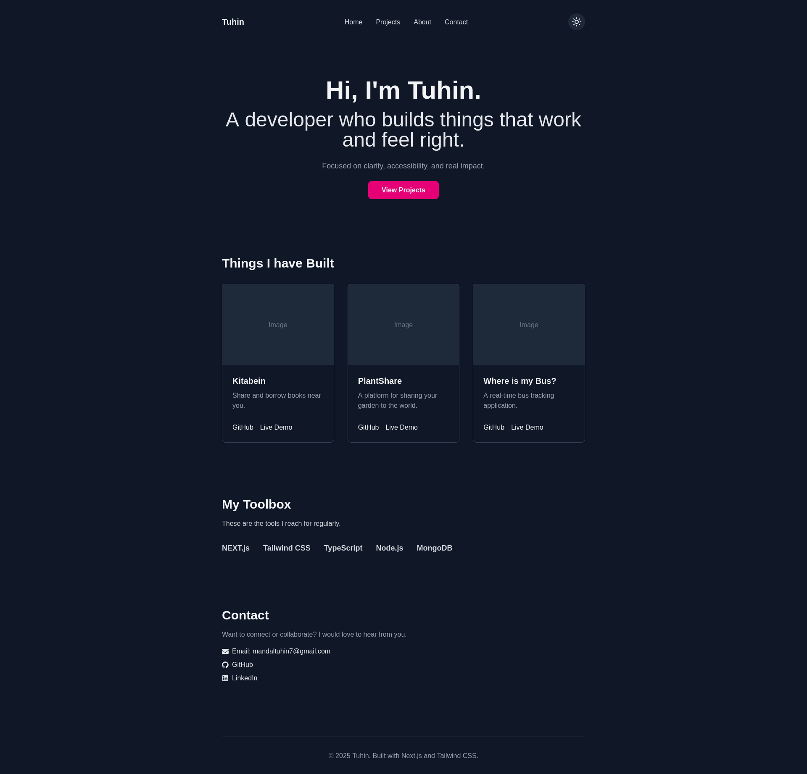

# Tuhin Mandal — Developer Portfolio

Welcome to my personal portfolio website! This project is built using **Next.js** and **Tailwind CSS**, showcasing my skills in responsive UI development, clean code architecture, and design thinking.

---

## 🚀 About Me

I'm **Tuhin Mandal**, a self-driven developer with a passion for building elegant and performant web interfaces.  
This portfolio reflects both my technical learning and personal growth journey — especially my commitment to discipline, recovery, and focused development.

---

## 🛠️ Tech Stack

- **Framework:** Next.js (App Router)
- **Languages:** TypeScript, JavaScript, HTML, CSS
- **Styling:** Tailwind CSS
- **Icons:** Lucide React
- **Deployment:** Vercel

---

## ✨ Features

- Clean, minimal and responsive layout
- Light/Dark mode toggle
- Dynamic project showcase section
- Built for speed and accessibility

---

## 🖼️ Preview

### 🌞 Light Mode


### 🌙 Dark Mode



---

## 📂 Folder Structure

```plaintext
├── public/ → Static assets (images, icons, favicon)
├── src/
│ ├── app/ → Pages and routes
│ ├── components/ → Reusable UI components
│ └── styles/ → Tailwind config (globals.css)
```

---

## 🧩 Projects

### 🔐 [Modern Login Page Mock](https://modern-login-mock.vercel.app/)

A clean and responsive login page mockup built using Tailwind CSS and React.

- [GitHub Repo](https://github.com/MandalTuhin/modern-login-mock)

### 📱 [Frontend Mentor Projects](https://github.com/MandalTuhin)

Completed challenges from Frontend Mentor to sharpen UI/UX and responsive design skills.  
Includes:

- [Product preview card component](https://www.frontendmentor.io/solutions/product-preview-card-component-solution-using-mobile-first-workflow-ES2taARNL7)
  - [Github repo](https://github.com/MandalTuhin/product-preview-card-component)
  - [Live demo](https://product-card-demo-tm.netlify.app/)
- [QR code component](https://www.frontendmentor.io/solutions/mobile-first-solution-using-flexbox-S_sgclQLd1)
  - [Github repo](https://github.com/MandalTuhin/qr-code-component-main)
  - [Live demo](https://qr-code-component-main.vercel.app/)

---

## 📬 Contact

📧 Email: [mandaltuhin7@gmail.com](mailto:mandaltuhin7@gmail.com)  
🔗 LinkedIn: [linkedin.com/in/tuhin-mandal-2157102aa](https://www.linkedin.com/in/tuhin-mandal-2157102aa)  
🐙 GitHub: [github.com/MandalTuhin](https://github.com/MandalTuhin)

---

## 📝 Getting Started (for local setup)

```bash
git clone https://github.com/MandalTuhin/tuhin-mandal-portfolio.git
cd tuhin-mandal-portfolio
npm install
npm run dev
```

Open your browser and navigate to `http://localhost:3000` to view the portfolio.

---

## 📄 License

This project is licensed under the MIT License - see the [LICENSE](./LICENSE) file for details.

---

Thank you for visiting my portfolio!
Let’s build something impactful together. 🌱
